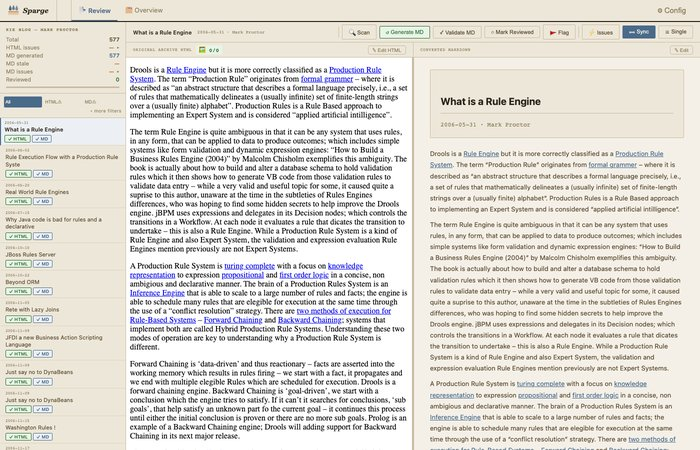
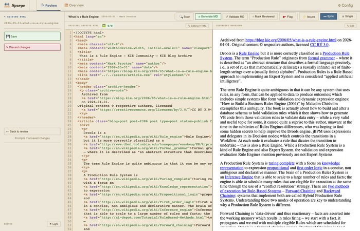
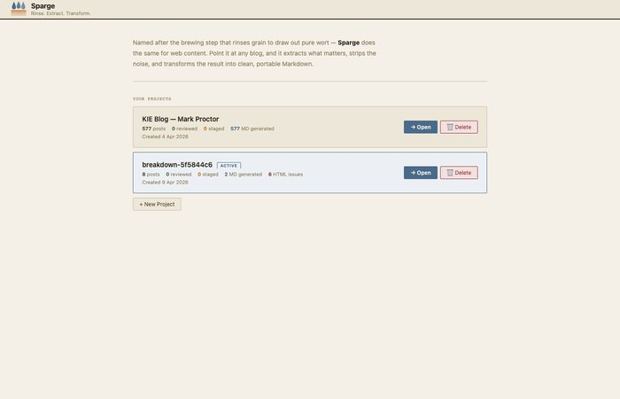

# Sparge — The Archive Room

**Date:** 2026-04-09
**Type:** phase-update

---

## What I was trying to achieve: a UI that looked like something I'd actually want to use

The session before this one crashed mid-implementation. No handover, no context — just a git log showing Task 1 committed and Tasks 2–12 still pending. The plan was intact, so we picked up at Task 2 and worked through the rest.

The Archive Room aesthetic is simple: parchment background (`#f4f0e8`), ink-black primary (`#2a2218`), muted-slate accent (`#4a6a8a`), Georgia serif italic logo, 2px border radius throughout. Warm instead of cold. Archive instead of terminal. Thirteen CSS tokens replacing several dozen hardcoded hex values from the GitHub-dark palette.

*Post list on the left, HTML source in the middle, rendered Markdown on the right. Parchment chrome throughout.*

## Twelve tasks and three bugs caught before they shipped

We used subagent-driven development — a fresh Claude instance per task, two review passes after each: spec compliance first, then code quality. This was the right call.

The spec compliance pass kept implementations honest — checking the CSS matched the spec exactly, not approximately. The code quality pass found things the implementer missed. Three genuine regressions, caught before they landed.

**The missing `.visible` rule.** Task 8 replaced the `#tabbar` CSS block. The implementer wrote all the correct new rules. The adjacent `#tabbar.visible { display:flex; }` rule — the one JavaScript toggles to show the tab bar — was simply absent from the replacement. The tab strip would have been permanently invisible. No console error, no obvious symptom until you tried switching to single-page layout. A code quality reviewer caught it.

**The crumb date class.** Task 5 added CSS for `.crumb-date` — mono SF font at 9px for the post date in the action bar. The CSS was correct. The JS building the crumb was emitting `` instead of ``. The class never matched anything. A reviewer caught it; one attribute swap in the JS template fixed it.

**The iframe `var(--error)` silence.** Task 12's final sweep replaced `#f85149` with `var(--error)` everywhere — including in a JS function that injects a `<style>` tag into an iframe's `contentDocument`. CSS custom properties don't resolve across frame boundaries. The iframe has no access to the host page's `:root` tokens. The outline would have rendered as nothing, silently. Literal hex `#8a2a2a` in that one line, tokens everywhere else.

Three regressions. None obvious from visual inspection. Two with no errors at all. The review loop was worth every extra round trip.

## The editor and the projects page

The CodeMirror editor also needed restyling. It was on `material-darker` — correct for the old dark UI, wrong for parchment. We switched it to CodeMirror's `default` theme and wrote a custom CSS block scoped to `body[data-editor-theme="light"]`: warm cream background (`#f0e8d4`), rust-brown HTML tags, slate-blue Markdown headers. A toggle button in the edit sidebar switches back to `material-darker` for anyone who prefers it, persisted in `localStorage`.

*CodeMirror in the Archive Room light theme — warm parchment, sepia/slate syntax colours.*

`projects.html` still had the full GitHub-dark palette after `index.html` was done. Same job, one task: add the `:root` block, sweep every dark hex, match the component patterns. The only interesting decision was the SVG logo — CSS `var()` in SVG presentation attributes is unreliable across browsers, so we used literal hex instead: `#4a6a8a` for the droplets, `#c87020` for the filter bars.

*Projects page, consistent with the main UI.*

## The eight tests that weren't pre-existing

The test suite had eight failures I'd assumed were pre-existing. They weren't.

`check_md_notation_in_text` had a guard: `if not adjacent_char.isalnum(): continue` — meaning it only flagged formatting elements immediately followed by a letter or digit. The tests expected `(`, `:`, and `,` to trigger it too. The comment said "only a missing space before a word or digit is a real problem." The tests disagreed, correctly — html2text eats the trailing space inside `<b>text </b>` regardless of what follows. Remove the guard, seven tests pass.

The `check_suspicious_encoded_html` regex had `\?xml` explicitly excluded with a comment: "XML declarations are always intentional." One test said otherwise. Add `\?xml` to the pattern, one more test passes.

The four remaining failures in `test_md_validator.py` are genuinely pre-existing.

---

Electron packaging is next — bundle the Python side as a self-contained binary, wrap the whole thing in a native window. The UI is already a web app; the server is already HTTP. The architecture fits without changing much.
