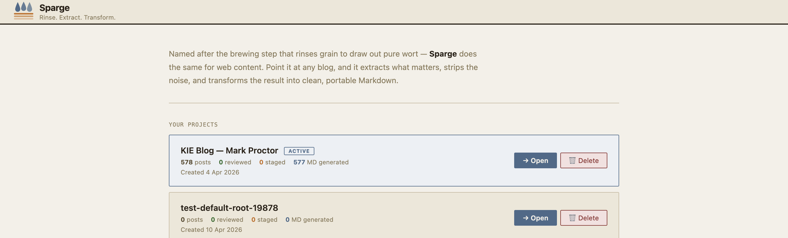
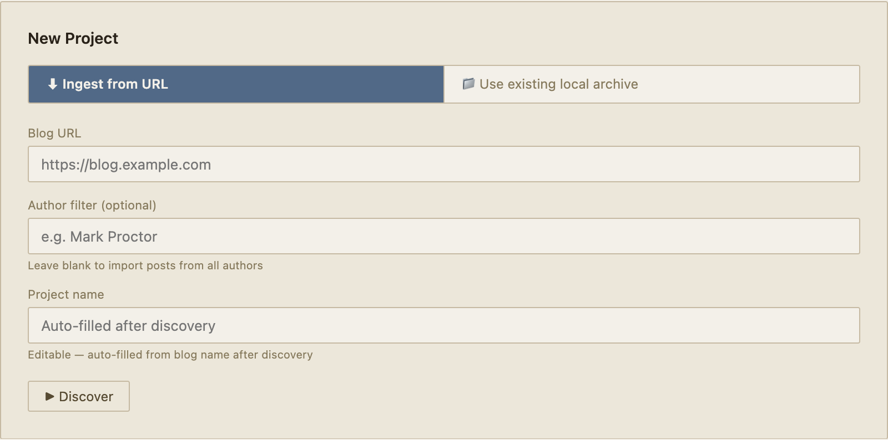

# Creating Your First Project

A *project* in Sparge is a migration workspace for one blog. It tracks your posts, their pipeline state, and where everything lives on disk.

## The Projects screen

The **Projects** screen shows all your projects. Each card displays the project name and a summary of posts by pipeline state.

*The Projects screen. Click **New Project** to create your first migration project.*

Click **New Project** to open the project creation form.

## The New Project form

*The New Project form. Fill in the project name and the four path fields.*

Fill in:
- **Project name** — a label for this migration (e.g. "My Blog")
- **Serve root** — the root directory that contains your blog's content (images, assets, posts)
- **Posts directory** — where your HTML source files live, relative to serve root
- **MD directory** — where generated Markdown files will be written
- **Enriched directory** — where Sparge saves enriched HTML copies

## Using the folder picker

Click the 📁 button next to any path field to open your system's native folder picker.

*The native folder picker opens at your home directory. Navigate to the folder and click Open.*

> **Note:** Paths inside your serve root are stored as relative paths. Paths outside serve root are stored as absolute paths, so they work regardless of where your serve root is located.

## After creating the project

Your new project appears on the Projects screen. Click its card to open it and start working.

## The config panel

At any time, click the **Config** button in the top right to view your project's path configuration.

*The config panel shows all four path fields as read-only. They cannot be changed after the project is created.*

> **Why are paths locked?** After ingesting posts, Sparge's state tracks image locations, enriched HTML, and generated Markdown all relative to these paths. Changing them would break all those references. If you need different paths, create a new project.

The next step is [ingesting your posts](03-ingesting-posts.md).
