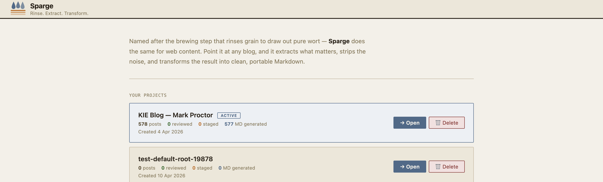

# Ingesting Posts

*Ingestion* is the first pipeline stage. Sparge reads your HTML posts, cleans them up, localises images, and registers them in the project's state tracker.

## Local ingest vs remote ingest

**Local ingest** is for HTML files already on your disk — for example, if you exported your blog or already have a directory of post files. Place the HTML files in your configured posts directory and Sparge picks them up automatically.

**Remote ingest** fetches posts directly from a live blog URL. Sparge detects the platform (Blogger, WordPress, etc.), discovers all post URLs, and lets you select which ones to import.

## Remote ingest walkthrough

Open your project and click the **Ingest** button to open the ingest panel.

*Enter your blog's URL to start the discovery process.*

Enter your blog's homepage or archive URL and click **Detect**. Sparge identifies the platform and discovers all post URLs. Select the posts you want to import — or select all — and click **Run Ingest**.

> **Note:** Sparge downloads and localises images during ingest. Posts with images hosted on services that block automated downloads fall back to the Wayback Machine automatically.

## What happens during ingest

For each post, Sparge:
1. Fetches the HTML and extracts the article content
2. Strips tracking scripts, share buttons, and blog chrome
3. Downloads images to your assets directory
4. Applies code block fixes (normalises ` ` in `<pre>` blocks, converts span-tokenised code)
5. Writes the cleaned HTML to your posts directory
6. Registers the post in the project state

The next step is [understanding the pipeline](04-the-pipeline.md).
