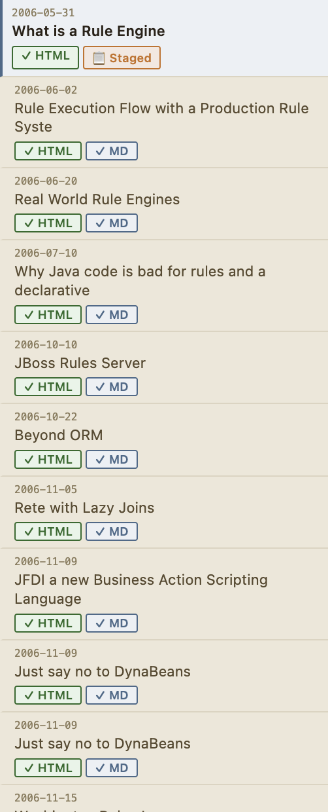

# Understanding the Pipeline

Every post in Sparge moves through the same pipeline. Understanding the pipeline helps you know what to do next for any post.

## Pipeline stages

```
Ingest → Enrich → Scan → Generate MD → Validate → Stage → Publish
```

| Stage | What happens |
|-------|-------------|
| **Ingest** | HTML fetched, cleaned, images localised, registered in state |
| **Enrich** | YouTube embeds replaced with thumbnails, Gist scripts inlined, code classes normalised |
| **Scan** | Enriched HTML checked for 12 issue types — broken images, external images, tracking pixels, etc. |
| **Generate MD** | Enriched HTML converted to Markdown |
| **Validate** | Generated Markdown cross-validated against HTML — checks for missing images, garbling, fence breaks |
| **Stage** | Draft of edited Markdown saved alongside the published version for review |
| **Publish** | Final Markdown copied to your Jekyll publishing directory |

> **Note:** Enrichment happens automatically the first time you scan a post. You don't need to run it separately.

## Reading pipeline state in the post list


*Each row shows the post's current pipeline state. Badges indicate completed stages.*

Each row in the post list shows:
- Whether the post has been scanned and how many HTML issues it has
- Whether Markdown has been generated and whether it's stale
- Whether the post has been reviewed

A post is *stale* if the HTML has been modified after the Markdown was generated. Regenerate the Markdown to bring it back in sync.

## Working through the pipeline

The typical workflow for each post:
1. **Scan** the post to enrich it and check for HTML issues
2. Fix any HTML issues that can't be auto-corrected
3. **Generate MD** to convert the cleaned HTML to Markdown
4. Review the generated Markdown in the editor
5. Edit if needed, then **Stage** your changes
6. **Accept** the staged version to publish it

See [Working With Posts](05-working-with-posts.md) for the step-by-step workflow.
