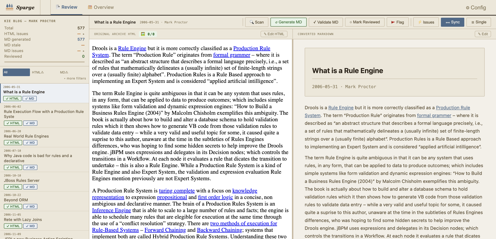
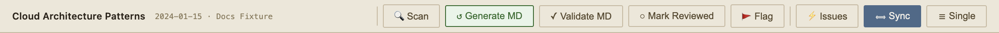

# Working With Posts

The post list is the heart of Sparge. From here you can see every post's pipeline state, open a post for editing, and run pipeline actions.

## The post list

*The post list shows every ingested post with its pipeline state at a glance.*

Each row shows the post title, date, and status badges. Click any row to open the post in the split-pane editor. Use the search bar and filters at the top to narrow the list — see [Filtering & Search](09-filtering-and-search.md).

## The split-pane view

*The split-pane editor: HTML on the left, Markdown on the right. Drag the divider to resize.*

Clicking a post opens the split-pane editor. The left pane shows the HTML source; the right pane shows the generated Markdown. Both editors scroll in sync as you move through the content.

Drag the **divider** between panes to give more space to whichever side you're working on.

## Pipeline action buttons

*Pipeline action buttons run the next stage for the current post.*

| Button | What it does |
|--------|-------------|
| **Scan** | Enriches the HTML (if not yet enriched) and checks for issues |
| **Generate MD** | Converts the enriched HTML to Markdown |
| **Stage** | Saves your edited Markdown as a draft for review |
| **Accept** | Promotes the staged draft to the published Markdown |
| **Reject** | Discards the staged draft and restores the previous Markdown |

## Post metadata

*Per-post controls: flag, note, review, and copy the title to clipboard.*

Each post has metadata controls:
- **Flag (⚑)** — marks a post for follow-up. Flagged posts are visually distinguished in the list.
- **Note** — a private text note attached to the post, visible in the list.
- **Reviewed (✓)** — tick this when you're happy with the Markdown and have finished the post.
- **Copy title (⎘)** — copies the post title to your clipboard with one click.
