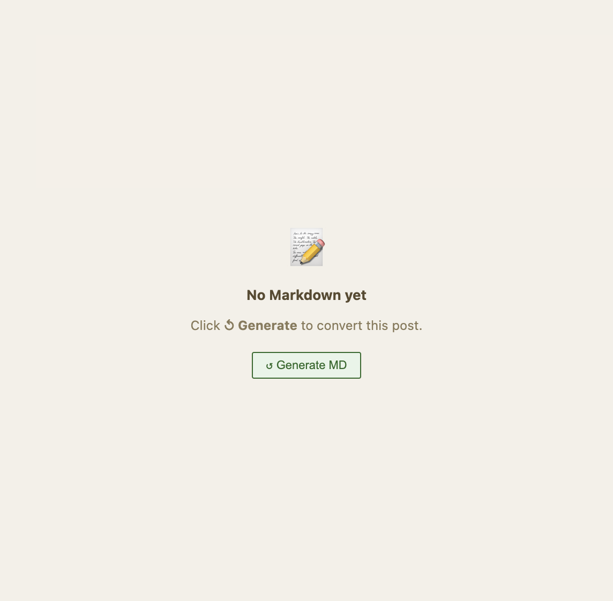

# The Markdown Editor

The right pane shows the generated Markdown for the current post. You can read it, edit it, and stage your changes for review.

## The editor

*The Markdown editor: generated Markdown with syntax highlighting. Edit directly here.*

The Markdown editor is a [CodeMirror](https://codemirror.net/) instance with Markdown syntax highlighting. Click anywhere in the editor and type to make changes.

> **Note:** The Markdown shown here is generated from the enriched HTML. If the HTML changes (e.g. you edit and rescan it), the Markdown may become *stale* — indicated by a warning in the post list. Regenerate the Markdown to bring it back in sync.

## Validation results

*Validation issues appear alongside the Markdown. Red indicates errors; yellow indicates warnings.*

After generating Markdown, Sparge validates it against the HTML source. Validation checks for missing images, encoding corruption, broken code fences, and other issues. Results are shown in the **Issues Panel**.

## The staging workflow

Editing the Markdown directly changes the working copy. To safely review your changes before committing, use the staging workflow:

1. Make your edits in the Markdown editor
2. Click **Stage** — Sparge saves a `.staged` copy alongside the published Markdown
3. Review the staged version — the editor shows the staged content
4. Click **Accept** to promote the staged version to published, or **Reject** to discard it

*When a post has a staged draft, the editor shows the staged content and displays Accept/Reject buttons.*

## Autosync scroll

The Markdown editor scrolls in sync with the HTML editor on the left. Scroll either pane and the other follows.
