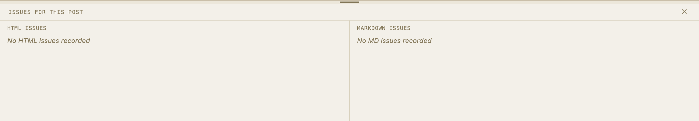
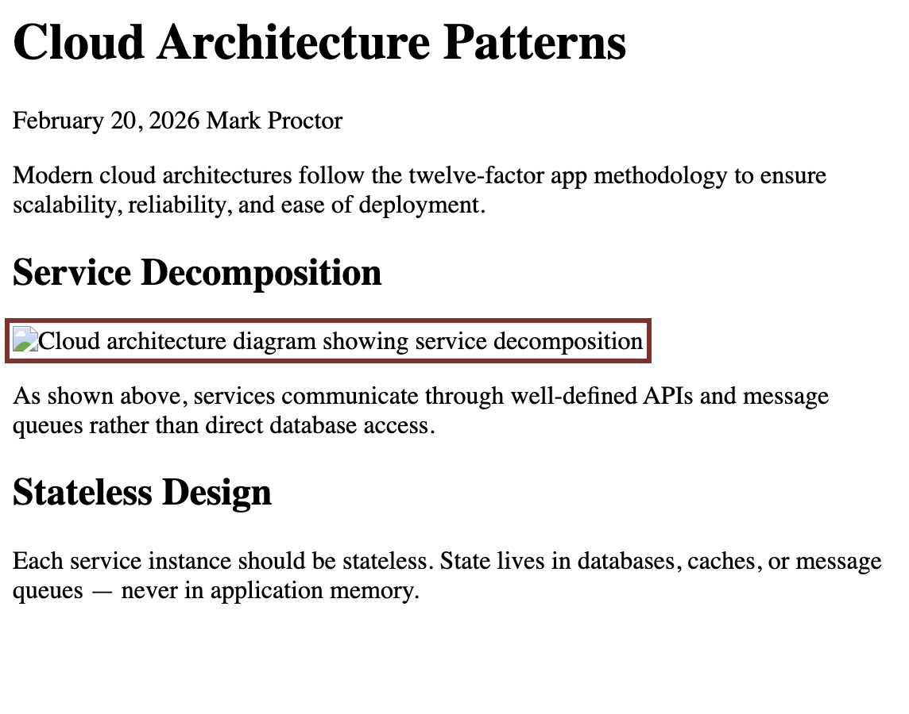
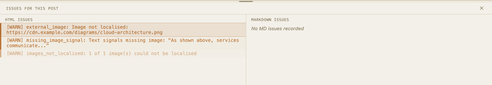
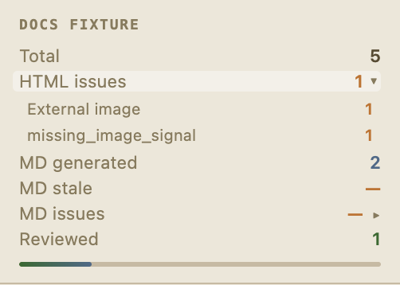

# The Issues Panel

The Issues Panel shows everything Sparge found wrong with a post — in the HTML and in the generated Markdown. Each issue tells you what the problem is and where it is.

## Opening the panel

Click the **Issues** button to open the panel alongside the editors. The panel shows two tabs: **HTML Issues** (found during scan) and **MD Issues** (found during validation).

*The Issues Panel lists all issues found in the current post, grouped by type.*

## Reading an issue

Each issue shows:
- **Type** — the category of problem (e.g. `external_image`, `tracking_pixel`)
- **Description** — a plain-language explanation of what was found
- **Severity** — error (must fix before publishing) or warning (review but may be acceptable)

## Issue highlighting

*Clicking an issue highlights the relevant element in the HTML editor and scrolls to it.*

Click any issue to jump to it in the HTML editor. The element that caused the issue is highlighted. This makes it straightforward to find and fix problems in long posts.

## Dismissing issues

*Hover over an issue to reveal the dismiss button.*

If an issue is acceptable — for example, an external image you've intentionally kept — hover over it and click **Dismiss**. Dismissed issues are hidden from the panel. Click **Show dismissed** then **Undismiss** to restore a dismissed issue.

> **Note:** Dismissing an issue doesn't fix it — it tells Sparge you've reviewed it and decided it's acceptable. The issue is still present in the HTML.

## Issue breakdown

*The issue breakdown shows a summary of issue counts across all posts, grouped by type.*

The issue breakdown panel shows aggregate counts of each issue type across your entire project. Use this to understand the scope of work before diving into individual posts.
