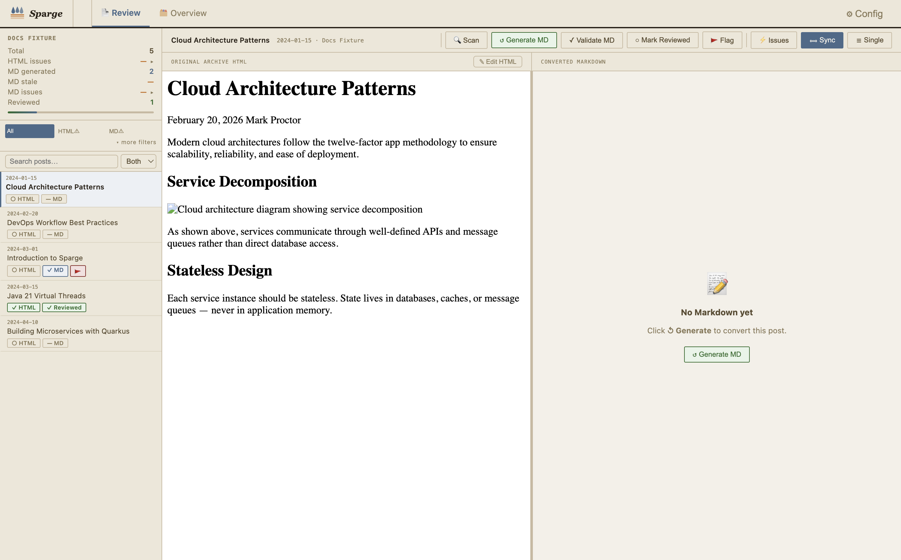

# Sparge User Guide

Sparge is a blog migration tool for technical bloggers. It takes your existing HTML blog posts — from a live blog URL or a local directory — and converts them to clean Markdown ready for Jekyll, Hugo, or any static site generator.

*The main view: post list on the left, HTML and Markdown editors on the right.*

## What Sparge does

Every post flows through a pipeline: `Ingest → Enrich → Scan → Generate MD → Validate → Stage → Publish`. Sparge tracks where each post is in this pipeline and flags anything that needs your attention — broken images, encoding issues, unconverted code blocks — before you publish.

> **Note:** Sparge is a desktop application for macOS, Windows, and Linux. No command line required after installation.

## Contents

| Page | What it covers |
|------|---------------|
| [Features & Capabilities](features.md) | Complete list of everything Sparge can do |
| [Installation](01-installation.md) | Download, install, and first launch |
| [Creating Your First Project](02-first-project.md) | Set up a project and understand path configuration |
| [Ingesting Posts](03-ingesting-posts.md) | Import posts from a live blog or local files |
| [Understanding the Pipeline](04-the-pipeline.md) | How posts move from HTML to published Markdown |
| [Working With Posts](05-working-with-posts.md) | The post list, split-pane editor, and pipeline actions |
| [The HTML Editor](06-html-editor.md) | Edit and inspect HTML source |
| [The Markdown Editor](07-markdown-editor.md) | Review, edit, and stage generated Markdown |
| [The Issues Panel](08-issues-panel.md) | Understand and resolve HTML and Markdown issues |
| [Filtering & Search](09-filtering-and-search.md) | Find posts by content, issue type, and review state |
| [Staging & Publishing](10-staging-and-publishing.md) | The staging workflow and publishing to your blog |
| [Checks, Validations & Autocorrects](11-checks-and-validation.md) | Reference: everything Sparge detects and fixes |
