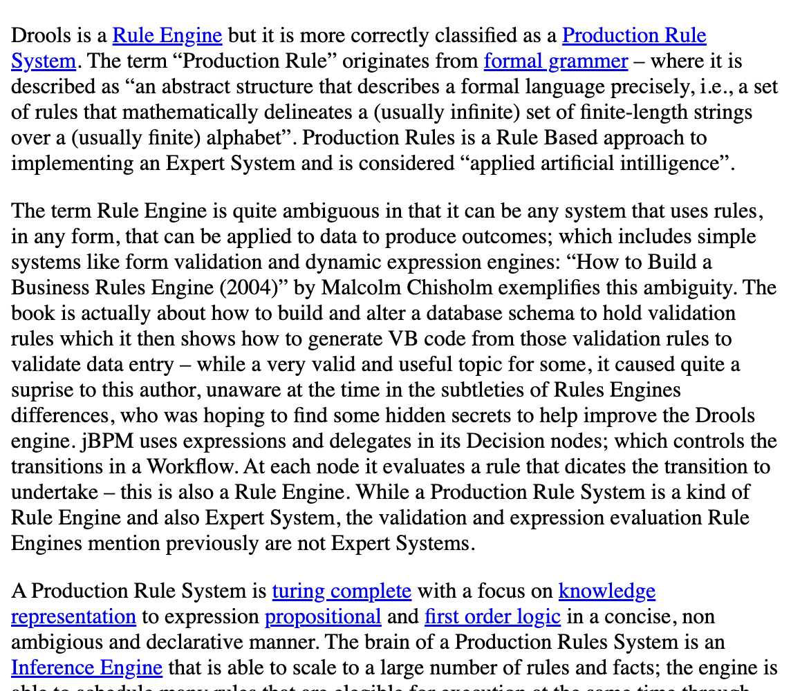
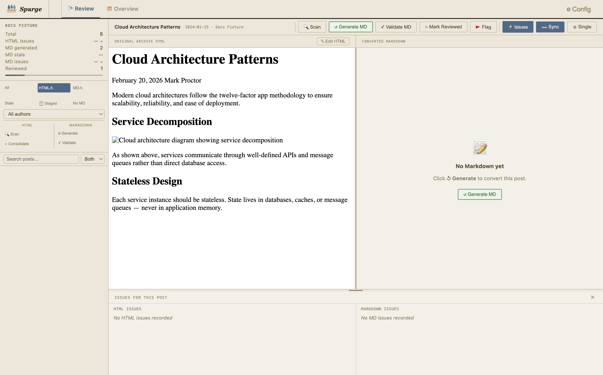
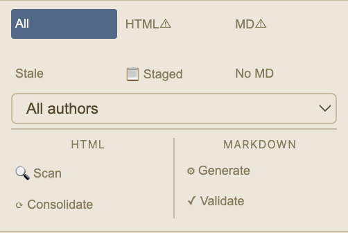
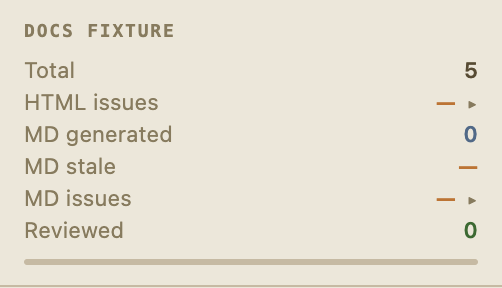
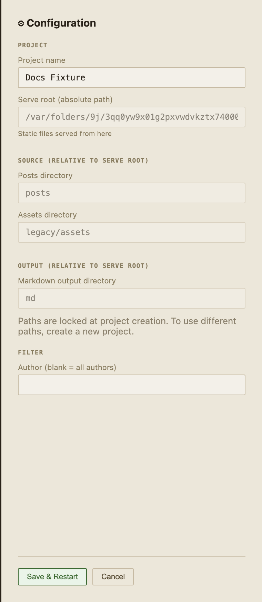

# Features & Capabilities

A complete reference of everything Sparge can do. If you're wondering whether Sparge supports a particular feature, check here first.

---

## Pipeline

| Feature | Description |
|---------|-------------|
| Local ingest | Import HTML posts from a local directory on disk |
| Remote ingest | Discover and import posts from a live blog URL (Blogger, WordPress) |
| Platform detection | Automatically detects the blog platform from the URL |
| URL discovery | Lists all post URLs on a blog for you to select from |
| Enrichment | Replaces YouTube embeds with thumbnails, inlines Gist code, normalises code classes |
| HTML scanning | Detects 12 issue types in your HTML — see [Checks & Validation](11-checks-and-validation.md) |
| MD generation | Converts enriched HTML to clean Markdown |
| MD validation | Cross-validates generated Markdown against the HTML source |
| Staging | Save a draft of edited Markdown alongside the published version |
| Asset localisation | Downloads and localises remote images at ingest time |
| Wayback fallback | Uses the Wayback Machine for images that fail to download |

---

## Editors

*The HTML editor: CodeMirror with syntax highlighting, issue highlights, and save/revert controls.*

| Feature | Description |
|---------|-------------|
| HTML editor | CodeMirror editor with full HTML syntax highlighting |
| Markdown editor | CodeMirror editor with Markdown syntax highlighting |
| Autosync scroll | HTML and Markdown editors scroll in sync as you move through a post |
| Drag divider | Drag the divider between HTML and MD panes to resize them |
| Issue highlights | Clicking an issue in the Issues Panel highlights the relevant element in the HTML editor |
| Dark/light theme | Toggle between dark and light theme — preference saved across sessions |

*The theme toggle switches between light and dark mode. Your preference is remembered between sessions.*

---

## Navigation & Search

*Search narrows the post list in real time. Switch between title-only and full-body search.*

| Feature | Description |
|---------|-------------|
| Search bar | Search post titles, body text, or both — server-side body search across all posts |
| Search scope | Switch between **Title**, **Body**, and **Both** search modes |
| Issue-type filter | Filter the post list to only show posts with a specific issue type |
| Author filter | Filter posts by author (for multi-author blogs) |
| Reviewed filter | Show only posts you've marked as reviewed |
| Combined filters | All filters can be used together simultaneously |

*Switch search scope between Title, Body, and Both using the selector next to the search bar.*

---

## Post Management

*Per-post controls: flag, note, review, and copy the title to clipboard.*

| Feature | Description |
|---------|-------------|
| Flag | Mark a post for follow-up attention |
| User note | Attach a private note to a post (visible in the post list) |
| Review checkbox | Mark a post as reviewed once you're happy with the Markdown |
| Copy title (⎘) | Copy the post title to clipboard with one click |
| Floating tooltip | The copy title button shows a tooltip positioned above any overflow container |
| Pipeline actions | Scan, Generate MD, Stage, Accept, Reject — all accessible from the post view |

---

## Project Management

*The config panel shows your project's path configuration. Paths are set at creation time and locked thereafter.*

| Feature | Description |
|---------|-------------|
| Multiple projects | Create and switch between multiple blog migration projects |
| Native folder picker | Click 📁 to pick directories with the native OS folder picker |
| Path locking | Project paths are set once at creation and cannot be changed — protecting existing ingested content |
| Config panel | View your project's path configuration at any time from the top-right button |
| Project delete | Remove a project from Sparge's index (source files are not deleted) |
| Dark/light theme | Theme toggle available in the top bar |
